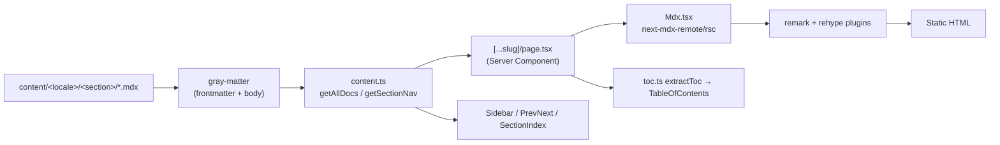
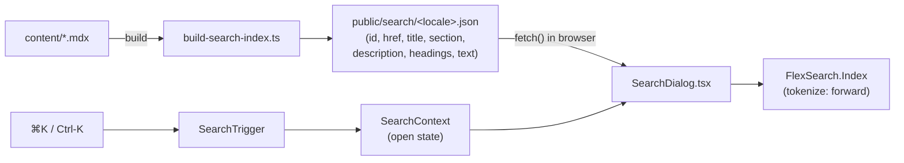

# Architecture

How the BLOK Capital documentation site is built and rendered. Everything here is
traceable to a file in the repository.

## Stack

| Layer | Technology | Source of truth |
|-------|-----------|-----------------|
| Framework | Next.js 15 (App Router) | [next.config.ts](../next.config.ts), [package.json](../package.json) |
| UI runtime | React 19 (Server + Client Components) | `package.json` |
| Language | TypeScript 5 (strict, `noEmit`) | [tsconfig.json](../tsconfig.json) |
| Styling | Tailwind CSS 3 + PostCSS + Autoprefixer | [tailwind.config.ts](../tailwind.config.ts), `postcss` key in `package.json` |
| Content | MDX via `next-mdx-remote/rsc` | [src/components/docs/Mdx.tsx](../src/components/docs/Mdx.tsx) |
| Search | FlexSearch (client) + build-time index | [src/components/search/](../src/components/search/), [scripts/build-search-index.ts](../scripts/build-search-index.ts) |
| Build scripts | Node + `tsx` | [scripts/](../scripts/) |

Rendering model: **fully static (SSG)**. The doc route sets
`export const dynamicParams = false` and enumerates every page through
`generateStaticParams`, so `next build` prerenders all routes to static HTML. The
production build (verified) emits **163 static pages**.

## Directory layout

```
docs/                       ← this engineering documentation
content/<locale>/<section>/ ← MDX source (en | es | fr × 4 sections)
public/
  search/<locale>.json      ← generated FlexSearch records (per locale)
  llms.txt, llms-full.txt   ← generated AI/answer-engine corpus
  img/ brand/ textures/     ← static assets
scripts/                    ← build-time TS scripts (run via tsx)
src/
  app/                      ← App Router routes + metadata routes
  components/               ← React components (docs shell, nav, search, ui)
  lib/                      ← content loader, config, SEO, TOC, utils
    data/                   ← auditData.json, tokenData.json (component data)
```

## Routing

App Router structure under [src/app/](../src/app/):

| Route file | Path | Responsibility |
|------------|------|----------------|
| [page.tsx](../src/app/page.tsx) | `/` | `redirect()` to `/${DEFAULT_LOCALE}` (`/en`). |
| [layout.tsx](../src/app/layout.tsx) | (root) | Site-wide `<head>` metadata only; a pass-through layout (no `<html>`). |
| [[locale]/layout.tsx](../src/app/[locale]/layout.tsx) | `/:locale` | Renders `<html lang>`, fonts, `Nav`, `Footer`, `SearchProvider`, and site-wide JSON-LD. |
| [[locale]/page.tsx](../src/app/[locale]/page.tsx) | `/:locale` | Locale home — a grid of the four section cards with page counts. |
| [[locale]/[...slug]/page.tsx](../src/app/[locale]/[...slug]/page.tsx) | `/:locale/*` | Doc pages **and** section landings. |
| [not-found.tsx](../src/app/not-found.tsx) | 404 | Renders its own `<html>`/`<body>` (lives outside the locale tree). |

Why `<html>` lives in the locale layout: the root [layout.tsx](../src/app/layout.tsx)
is a pass-through (`return children`) because the `lang` attribute depends on the
active locale, which is only known inside `[locale]/`. Routes outside that tree
(the global 404) supply their own `<html>`/`<body>`.

### Static param generation

- `[locale]/layout.tsx` → `generateStaticParams()` returns one entry per `LOCALES`.
- `[locale]/[...slug]/page.tsx` → `generateStaticParams()` returns **section roots**
  (`/<locale>/<section>`) **plus** every doc param from
  `getAllDocParams()` ([src/lib/content.ts](../src/lib/content.ts)).
- `isSectionRoot(slug)` distinguishes a one-segment section landing from a deeper
  doc page; landings render `<SectionIndex>`, doc pages render `<Mdx>`.

## Content pipeline

The filesystem **is** the content database. [src/lib/content.ts](../src/lib/content.ts)
walks `content/<locale>/<section>/**` and parses each `.md`/`.mdx` file with
`gray-matter`.



Key functions in [content.ts](../src/lib/content.ts):

| Function | Purpose | Notes |
|----------|---------|-------|
| `getAllDocs(locale)` | All docs for a locale across sections. | Wrapped in React `cache()` so the filesystem walk runs once per locale per render pass (not once per ~140 pages). |
| `getDoc(locale, segments)` | One doc by URL segments. | Returns `null` if not found → `notFound()`. |
| `getAllDocParams()` | Every `(locale, slug)` pair. | Drives `generateStaticParams`. |
| `getSectionNav(locale, section)` | Ordered nav tree for a section. | `cache()`d; mirrors folder hierarchy. |
| `flattenNav(nodes)` | Flatten tree into ordered links. | Drives prev/next pagination. |

Conventions enforced by the loader:

- A file named `index.mdx` represents its **parent folder's** landing page
  (its segments collapse to the folder).
- Folder ordering and labels come from `_category.json` (`{ label, position }`);
  the legacy `_category_.json` name is also accepted.
- Ordering is `position` ascending, then label `localeCompare` as a tiebreaker.
  Missing `position` defaults to `999`.
- A `doc` node's label is `sidebar_label ?? title ?? titleFromSlug(base)`.

The `Doc` and `NavNode` types are defined in
[content.ts](../src/lib/content.ts) and are the canonical shapes consumed by the
route and components.

## MDX rendering

[Mdx.tsx](../src/components/docs/Mdx.tsx) renders the MDX body with
`next-mdx-remote/rsc` (a Server Component). It wires:

**remark plugins** — `remark-gfm` (tables, task lists, autolinks),
`remark-math` (math syntax).

**rehype plugins** (in order) —
1. `rehype-slug` — heading ids (must match the TOC slugger; see below).
2. `rehype-katex` (`strict: false`) — render math.
3. `rehype-pretty-code` — Shiki highlighting, theme `github-dark`,
   `keepBackground: true`, `defaultLang: "text"`.
4. `rehype-autolink-headings` (`behavior: "append"`) — appends a `#` anchor link
   (`.heading-anchor`, `aria-label="Link to section"`) to each heading.

**Components map** — MDX tags resolve to React components:

| MDX usage | Component | File |
|-----------|-----------|------|
| `<a>` | `MdxLink` | internal → `next/link`; external → `<a target="_blank" rel="noopener noreferrer">` |
| `` | `MdxImage` | plain lazy `` (not `next/image`, since content images have unknown dimensions) |
| `<Admonition>` | `Admonition` | [Admonition.tsx](../src/components/docs/Admonition.tsx) |
| `<Audit>` | `AuditReports` | [AuditReports.tsx](../src/components/docs/AuditReports.tsx) |
| `<Chart>` | `TokenomicsChart` | [TokenomicsChart.tsx](../src/components/docs/TokenomicsChart.tsx) |
| `<Mermaid>` | `Mermaid` | [Mermaid.tsx](../src/components/docs/Mermaid.tsx) |
| `<UserJourneyDiagram>` … | `* as Diagrams` | [diagrams.tsx](../src/components/docs/diagrams.tsx) |

The table of contents is **not** derived from the rendered DOM; it is extracted
from the raw MDX by [toc.ts](../src/lib/toc.ts) `extractToc()`, which uses the
same `github-slugger` algorithm as `rehype-slug` so anchor ids line up. Fenced
code blocks are skipped so `#` comments inside code aren't read as headings.

## Search architecture

Two halves — a build step and a client step — that never talk to a server at
runtime.



- **Build** — [build-search-index.ts](../scripts/build-search-index.ts) writes one
  JSON array per locale to [public/search/](../public/search/). Each record:
  `{ id, href, title, section, description, headings: {text,slug}[], text }`,
  where `text` is plain-text-stripped and capped at 4000 chars.
- **State** — [SearchContext.tsx](../src/components/search/SearchContext.tsx)
  holds `{ open, setOpen }`; `useSearch()` throws if used outside the provider.
- **Trigger** — [SearchTrigger.tsx](../src/components/search/SearchTrigger.tsx)
  registers a global `keydown` listener; `⌘K`/`Ctrl+K` opens the dialog.
- **Dialog** — [SearchDialog.tsx](../src/components/search/SearchDialog.tsx)
  `fetch()`es `/search/<locale>.json`, builds a `FlexSearch.Index`
  (`tokenize: "forward", cache: true`), and queries with
  `{ limit: 12, suggest: true }`. Results are re-ranked (+3 title match,
  +2 heading match), windowed into ~180-char snippets with `<mark>` highlights,
  and deep-linked to the matched heading anchor. Rendered through a
  `react-dom` portal; full keyboard nav (`↑`/`↓`/`Enter`/`Esc`) and ARIA
  combobox/listbox roles.

## Component map

All components live under [src/components/](../src/components/). "Client" means the
file begins with `"use client"`.

### Docs shell — [src/components/docs/](../src/components/docs/)

| Component | Client? | Role |
|-----------|:------:|------|
| `Mdx` | server | Renders the MDX body (see above). |
| `Admonition` | server | Callout box (`note`/`tip`/`info`/`warning`/`danger`). |
| `Figure` | server | Framed/scrollable wrapper with optional `<figcaption>`; `narrow` constrains width. |
| `Mermaid` | client | Dynamically `import("mermaid")`, renders SVG (`theme: base`, `securityLevel: strict`); falls back to a `<pre>` on error. |
| `diagrams` | server | 14 named diagram components — 12 wrap `Mermaid`, 2 are hand-authored inline SVG. |
| `AuditReports` | server | Renders audit cards from [auditData.json](../src/lib/data/auditData.json). |
| `TokenomicsChart` | client | SVG donut chart from [tokenData.json](../src/lib/data/tokenData.json); hover focus state. |
| `Sidebar` | client | Recursive, collapsible section nav; auto-opens the active branch via `usePathname()`. |
| `TableOfContents` | client | "On this page" scroll-spy via `IntersectionObserver` (`rootMargin: -15% 0 -70% 0`). |
| `Breadcrumbs` | server | `<nav aria-label="Breadcrumb">` trail. |
| `PrevNext` | server | Footer pager; returns `null` when both sides are empty. |
| `SectionIndex` | server | Section-landing card grid with per-category page counts. |

### Navigation — [src/components/nav/](../src/components/nav/)

| Component | Client? | Role |
|-----------|:------:|------|
| `Nav` | client | Sticky header: logo, section tabs (active via `usePathname`), search trigger, locale switcher, external site link. |
| `LocaleSwitcher` | client | Path-preserving language picker — rewrites the first path segment and `router.push()`es. |

### Search — [src/components/search/](../src/components/search/)

`SearchProvider` / `useSearch` (context), `SearchTrigger` (button + ⌘K), and
`SearchDialog` (portal dialog) — described under
[Search architecture](#search-architecture).

### UI — [src/components/ui/](../src/components/ui/)

| Component | Role |
|-----------|------|
| `Button` | Polymorphic — renders `next/link` (internal), `<a target=_blank>` (external), or `<button>`; variants `primary`/`outline`/`ghost`/`secondary`, sizes `sm`/`md`/`lg`. |
| `Logo` | Wordmark via `next/image` from `/brand/blokc-black.svg` (`unoptimized`, `priority`). |

### Footer — [src/components/footer/Footer.tsx](../src/components/footer/Footer.tsx)

Brand, tagline, and Protocol/Community link columns from `EXTERNAL`; copyright
year from `new Date().getFullYear()`.

## Styling system

- **Tailwind 3** with the *Garden Journal* token set
  ([tailwind.config.ts](../tailwind.config.ts)). Colors are wired through
  `<alpha-value>` (`rgb(var(--moss) / <alpha-value>)`) so opacity modifiers
  (`bg-moss/10`) work; the actual RGB triplets are CSS variables defined in
  [src/app/globals.css](../src/app/globals.css) (e.g. `--paper`, `--ink`,
  `--moss`, `--clay`).
- **Fonts** — `next/font/google`: Inter (body), Newsreader (display), Caveat
  (script), JetBrains Mono (code), exposed as `--font-*` CSS variables.
- **PostCSS** — configured via the `postcss` key in
  [package.json](../package.json) (`tailwindcss` + `autoprefixer`). Next.js'
  config loader supports this key but not a `.ts` PostCSS config, which is why it
  lives in `package.json` rather than a standalone file.
- `content` globs in the Tailwind config include both `src/**` and `content/**`
  so class names used inside MDX are not purged.

## Configuration as a single source of truth

[src/lib/config.ts](../src/lib/config.ts) is the runtime source of truth for
locales, sections, brand/SEO constants, UI strings, and external links. The build
scripts mirror `LOCALES`/`SECTIONS` in [scripts/_content.ts](../scripts/_content.ts);
[check-content.ts](../scripts/check-content.ts) asserts the two never drift. See
[CONFIGURATION.md](CONFIGURATION.md).

## Request/render lifecycle (build time)

1. `next build` runs the `prebuild` hook → regenerates the search index and
   `llms.txt`.
2. `generateStaticParams` enumerates every `(locale, slug)`.
3. For each page, the Server Component loads the doc via `content.ts`, extracts
   the TOC, builds the section nav, computes prev/next, and assembles JSON-LD.
4. `Mdx` renders the body through remark/rehype to HTML.
5. Next emits static HTML + the per-locale search JSON + metadata routes
   (`robots.txt`, `sitemap.xml`, `manifest.webmanifest`, `opengraph-image`).

There is no runtime server logic beyond serving the prerendered output.
