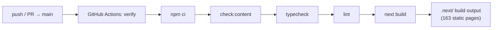

# CI/CD & Operations

What automation exists, how the site is built, and what is known about
deployment. Sourced from [.github/workflows/ci.yml](../.github/workflows/ci.yml)
and [package.json](../package.json).

## Continuous Integration

One GitHub Actions workflow: [.github/workflows/ci.yml](../.github/workflows/ci.yml).

**Triggers:** `push` and `pull_request` on `main`.

**Job `verify`** (single job, `ubuntu-latest`):

| Step | Command | Gate |
|------|---------|------|
| Checkout | `actions/checkout@v4` | — |
| Node setup | `actions/setup-node@v4`, `node-version: 20`, `cache: npm` | — |
| Install | `npm ci` | Fails on lockfile mismatch. |
| Validate content | `npm run check:content` | Fails on missing titles, broken internal links, or config drift. |
| Typecheck | `npm run typecheck` (`tsc --noEmit`) | Fails on any type error. |
| Lint | `npm run lint` (`next lint`) | Fails on ESLint errors. |
| Build | `npm run build` | Fails on any build/prerender error (runs the `prebuild` hook first). |



> The CI runner is **Node 20**, which is the project's declared floor. The build
> scripts run via `tsx` precisely so they execute on Node 20 without a separate
> compile step.

### Reproducing CI locally

```bash
npm ci
npm run check:content
npm run typecheck
npm run lint
npm run build
```

## Build output

`next build` produces a fully static (SSG) site:

- `dynamicParams = false` + `generateStaticParams` → every route is prerendered.
- The last verified build emitted **163 static pages** (locale homes, section
  landings, and all docs across 3 locales) plus the metadata routes
  (`robots.txt`, `sitemap.xml`, `manifest.webmanifest`, `opengraph-image`).
- Output lands in `.next/` (gitignored). The `prebuild` hook refreshes
  `public/search/*.json` and `public/llms*.txt` first.

## Serving

```bash
npm run start   # next start — serves the production build (default :3000)
```

`next start` runs the Next.js production server. Because the app is fully
prerendered and has no server-only data fetching, the output is also compatible
with static hosting / CDN delivery via a Next-aware host.

## Deployment

> **What the repository contains:** nothing. There is **no committed deployment
> configuration** — no `vercel.json`, `netlify.toml`, Dockerfile, Kubernetes
> manifest, Terraform, or deploy workflow. CI builds and verifies but does **not**
> deploy.

What can be stated factually from the code:

- The app targets the standard Next.js build (`next build`) + serve (`next start`)
  model (per [package.json](../package.json) and the README).
- It is fully static, with no runtime environment variables and no backend, so it
  is straightforward to host on any Next.js-compatible platform.
- The canonical production origin is `https://docs.blokcapital.io`
  (`SITE.url` in [config.ts](../src/lib/config.ts)); this is the value baked into
  canonicals, the sitemap, JSON-LD, and `robots.txt`.

Anything beyond the above (the actual hosting provider, DNS, TLS, CDN, preview
environments) is **not represented in this repository** and is therefore out of
scope for this document. Recommendations for making deployment reproducible live
in [HARDENING.md](HARDENING.md).

## Runtime configuration & secrets

- **No environment variables** are read anywhere in `src/` or `scripts/` (verified
  — no `process.env` usage at runtime).
- **No secrets** are required to build or run the site.
- The only "secret-like" placeholders are the commented search-engine
  **verification tokens** in [layout.tsx](../src/app/layout.tsx); these are public
  meta tags, not secrets.

## Observability

There is **no** logging, metrics, error-tracking, or analytics integration in the
repository. The site is static HTML; operational monitoring (uptime, CDN metrics)
would be provided by the hosting platform, which is not configured here.

## Rollback

Because the build is deterministic from the Git tree (no external data at build
time beyond the committed content), rolling back is equivalent to redeploying a
previous commit. There is no database or migration state to reconcile.
