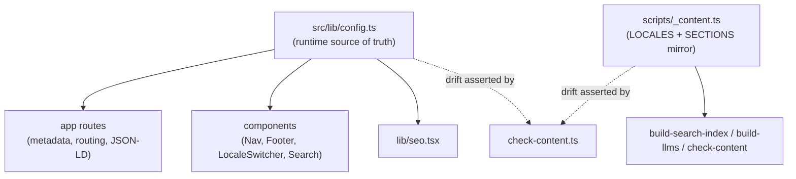

# Configuration

[src/lib/config.ts](../src/lib/config.ts) is the single runtime source of truth
for locales, sections, brand/SEO constants, UI strings, and external links. There
are **no environment variables** — all configuration is in code.

## Exports reference

| Export | Type | Purpose |
|--------|------|---------|
| `SITE` | const object | `name`, `brand`, `url` (canonical origin), `siteUrl` (marketing site), `tagline`, `description`. Drives titles, canonicals, JSON-LD. |
| `ORG` | const object | `name`, `legalName`, `logo`, `sameAs[]` — the Organization entity for JSON-LD / knowledge graph. |
| `TWITTER_HANDLE` | string | `@blok_cap` — used for `twitter:site`/`creator`. |
| `SITE_KEYWORDS` | string[] | Brand/topic keywords for root metadata. |
| `OG_LOCALE` | `Record<Locale,string>` | BCP-47 / OG locale codes (`en_US`, `es_ES`, `fr_FR`). |
| `LOCALES` | `readonly ["en","es","fr"]` | The supported locales. |
| `Locale` | type | `(typeof LOCALES)[number]`. |
| `DEFAULT_LOCALE` | `Locale` | `"en"` — redirect target and fallback. |
| `LOCALE_LABELS` | `Record<Locale,string>` | Display names (English / Español / Français). |
| `SECTIONS` | `readonly {slug,dir}[]` | The four top-level sections. |
| `SectionSlug` | type | `(typeof SECTIONS)[number]["slug"]`. |
| `UI` | `Record<Locale, {...}>` | Localized UI strings (section names, search, nav, etc.). |
| `SECTION_BLURB` | `Record<Locale, Record<SectionSlug,string>>` | One-line section descriptions for home + landings. |
| `EXTERNAL` | const object | External URLs (whitepaper, github, discord, telegram, x, site). |
| `isLocale(value)` | type guard | Narrows a string to `Locale`; used by routes to `notFound()` invalid locales. |

### Current values

- **Locales:** `en`, `es`, `fr` (default `en`).
- **Sections:** `concepts`, `smart-contracts`, `builders`, `resources`
  (each `slug` equals its `dir`).
- **Canonical origin:** `SITE.url` = `https://docs.blokcapital.io`.

## How configuration flows

> ⚠️ `LOCALES` and `SECTIONS` are duplicated in
> [scripts/_content.ts](../scripts/_content.ts) so the build scripts can run
> without importing the app. [check-content.ts](../scripts/check-content.ts) parses
> `config.ts` and **fails the build** if the two ever disagree. Whenever you edit
> locales or sections, update **both** files.

## How to add a locale

1. Add the code to `LOCALES` in [config.ts](../src/lib/config.ts) **and** to
   `LOCALES` in [scripts/_content.ts](../scripts/_content.ts).
2. Add entries to `OG_LOCALE`, `LOCALE_LABELS`, `UI`, and `SECTION_BLURB` for the
   new locale (TypeScript will flag the missing keys — they're `Record<Locale,…>`).
3. Create the content tree: `content/<newlocale>/{concepts,smart-contracts,
   builders,resources}/…` (mirror the English paths for parity).
4. Run `npm run check:content` (parity warnings will list any missing pages) and
   `npm run build`.

The router, sitemap, hreflang alternates, search index, and locale switcher all
derive from `LOCALES`, so no other code changes are required.

## How to add a section

1. Add `{ slug, dir }` to `SECTIONS` in [config.ts](../src/lib/config.ts) **and**
   to `SECTIONS` in [scripts/_content.ts](../scripts/_content.ts).
2. Add the section's label to `UI[*].sections` and a blurb to `SECTION_BLURB[*]`
   for **every** locale (TypeScript enforces this via `Record<SectionSlug,…>`).
3. Create `content/<locale>/<dir>/…` for each locale.
4. Run `npm run check:content` and `npm run build`.

The home page, section tabs in the nav, section landings, breadcrumbs, sitemap,
and `llms.txt` grouping all derive from `SECTIONS`.

> Note: `build-llms.ts` additionally has its own `SECTION_TITLES` /
> `SECTION_ORDER` maps for the curated `llms.txt` ordering — extend those if you
> want the new section to appear with a custom title/order in `llms.txt`.

## Changing brand / domain

- Update `SITE.url` to change the canonical origin (propagates to canonicals,
  sitemap, JSON-LD, robots `host`, OG image URL).
- Update `ORG`, `SITE_KEYWORDS`, `TWITTER_HANDLE`, and `EXTERNAL` for brand
  metadata and footer/nav links.

## Build/runtime config files

| File | Purpose |
|------|---------|
| [next.config.ts](../next.config.ts) | `reactStrictMode: true`; `experimental.optimizePackageImports: ["flexsearch"]`. |
| [tsconfig.json](../tsconfig.json) | Strict TS, `moduleResolution: bundler`, `@/* → ./src/*` path alias, `next` plugin. |
| [tailwind.config.ts](../tailwind.config.ts) | Garden Journal color/font tokens; `content` globs include `content/**`. |
| [.eslintrc.json](../.eslintrc.json) | Extends `next/core-web-vitals` + `next/typescript`. |
| `postcss` key in [package.json](../package.json) | `tailwindcss` + `autoprefixer`. |
